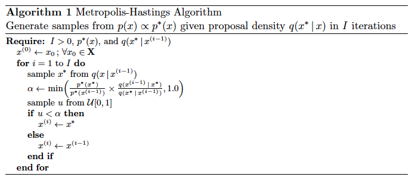
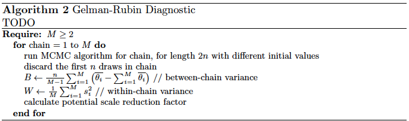

MCMC Tutorial
=============

**Authors:** John Letey, Mingxuan Zhang, H. Nihar Nandan

In this tutorial, we are going to introduce you to the basic concept of
Markov Chain Monte Carlo (which we will from now on abbreviate as MCMC).
If you want to see any of the code that was to long to put in the body
of the notebook, please go to the code section.

Linear Model and Parameter Estimation
-------------------------------------

.. raw:: html

   <!-- In a real world application, we would have some observations of a system. In this tutorial, we will instead fit a two parameter **linear model** to some pseudo observations that we generate. We choose this approach to reduce the complexity of learning and understanding MCMC. It is also useful in understanding the assumptions made according to the structure of the observations. (**This part was adapted from MCMC chapter1**). -->

Let's say we have a linear model that models the amount of ice cream you
will consume (where :math:`y` has units of pints) after going on a bike
ride of length :math:`x` (where :math:`x` has units of miles). So the
true process model, based on the unknown true values of the slope and
intercept parameters, which we can call :math:`\alpha^*` and
:math:`\beta^*`, is:

.. math:: y_{true} = \alpha^*x ~ + ~ \beta^*

We want to make this more realistic by incorporating some
normally-distributed uncertainty, for instance, with mean :math:`0` and
standard deviation :math:`\sigma`. Call these uncertain measurements
:math:`y_{meas}`:

.. math:: y_{meas} = y_{true} ~ + ~ \epsilon = \alpha^*x ~ + ~ \beta^* ~ + ~ \epsilon

where :math:`\epsilon \sim N(0, 1)` is our normally-distributed
measurement error. We now want to estimate :math:`\alpha` and
:math:`\beta`. Let us call :math:`\hat{\alpha}` and :math:`\hat{\beta}`
our estimates of these parameters. They lead to a set of estimates of
the response, :math:`\hat{y}`:

.. math:: \hat{y} = \hat{\alpha}x ~ + ~ \hat{\beta}

This technique is also known as the parameter estimation problem.

(**This part was adapted from in-class notebook MCMC and practicum**)

Generate Synthetic Data
-----------------------

We can now generate some synthetic data using our linear model, as
described above. To do this, we fix the :math:`x` distance values, at
which we will estimate our ice cream intake, covering the range from
:math:`0` to :math:`9.9` (inclusive), at intervals of :math:`0.1` miles.
In this particular case, let :math:`\alpha^* = 0.5` and
:math:`\beta^* = 8`, which represent the true parameters for our linear
model. (**This part was adapted from practicum**)

.. nbinput:: ipython3
    :execution-count: 3

    [(x_true, y_true), (x_meas, y_meas)] = generate_synthetic_data(astar=0.5, bstar=8, sigma=1, plot=True)

.. nboutput:: rst

    .. image:: output_4_0.png

Likelihood Function
-------------------

The likelihood function describes the plausibility of a parameter value
based on observations. Generally, we seek parameter values that maximize
the likelihood function. For this example, since we know that the data
is normally distributed with mean :math:`0` and standard deviation
:math:`\sigma`, we will use the product of normal distributions for each
data point to represent the likelihood function:

.. math:: L(y_{meas} \mid (\alpha, \beta)) = \prod_{i=1}^N f(\hat{y}_i-y_i \mid \mu=0, \sigma)

where :math:`f(\hat{y}_i-y_i \mid \mu=0, \sigma)` is a normal pdf
evaluated at :math:`\hat{y}_i - y_i`, with mean :math:`0` and standard
deviation :math:`\sigma`, and :math:`\hat{y} = \alpha x + \beta`
(evaluated at the ``x_true`` points).

(**This part was adapted from in-class notebook MCMC**)

.. nbinput:: ipython3
    :execution-count: 4
    :no-output:

    def likelihood(parameters, x_meas=x_meas, y_meas=y_meas, sigma=1):
        alpha, beta = parameters                                # unpack the parameters
        prod = 1                                                # initilize the product to 1
        for i in range(len(x_meas)):
            delta = alpha*x_meas[i] + beta - y_meas[i]          # the difference between the measured data and model data
            prod *= stats.norm.pdf(x=delta, loc=0, scale=sigma) # calculate the pdf (probability density function)
        return prod

Prior Distributions
-------------------

The prior probability is the probability that an event or observation
will occur before taking into account new evidence. It is based on
background information.

For this example, we could use a uniform prior distribution, for
:math:`\alpha \in [0,5]` and :math:`\beta \in [0,15]`. You may assume
that :math:`\alpha` and :math:`\beta` are independent, so their prior
distribution simplifies to
:math:`\pi(\alpha, \beta) = \pi(\alpha) \pi(\beta)`.

(**This part was adapted from practicum**)

.. nbinput:: ipython3
    :execution-count: 5
    :no-output:

    def prior(parameters):
        alpha, beta = parameters                # unpack the parameters
        if 0 <= alpha <= 5 and 0 <= beta <= 15: # we want to make sure alpha and beta stay in the range.
            return (1/5)*(1/15)                 # if it is true then we return the product of their pdf
        else:
            return 0                            # if it is not true, we return 0

Posterior Distribution/Posterior Score
--------------------------------------

To compute the acceptance probabilities for the Metropolis-Hastings
algorithm, we need to know the posterior probability. The posterior
probability is defined as being the probability that an event or
observation will occur after taking into account all evidence and
background information, in light of the uncertainties in both the
parameters and the observations. Bayes' theorem defines the posterior
probability as proportional to the likelihood of the observations given
the parameters times the prior probability of the parameters:

.. math:: \text{posterior distribution} = \pi((\alpha, \beta) \mid y_{meas}) = L(y_{meas} \mid (\alpha, \beta)) \times \pi(\alpha, \beta)

where :math:`L(y_{meas} \mid (\alpha, \beta))` is the likelihood
function and :math:`\pi(\alpha, \beta)` is the prior distribution for
:math:`\alpha` and :math:`\beta`

The posterior distribution therefore summarizes information about the
parameters based on the prior distribution and what the likelihood
function says about more "likely" parameter values. The posterior
therefore provides a range of parameter values, and says which values
are more probable than others.

In this analysis, you will work with the **log-probability
distributions** for numerical stability reasons. That is, the
probabilities involved may be very small, and computers may not be able
to distinguish them from 0 in many cases.

.. nbinput:: ipython3
    :execution-count: 6
    :no-output:

    def logpost(parameters, x_meas=x_meas, y_meas=y_meas, sigma=1):
        L = likelihood(parameters, x_meas, y_meas, sigma) # calculate the likelihood
        pi = prior(parameters)                            # calculate the prior
        return np.log(L*pi)                               # return the log of the posterior

Couple examples of parameter fits
---------------------------------

Provide examples of:

1. parameters that have high prior probability but low likelihood
2. parameters that have low prior probability but high likelihood
3. parameters that have bad both
4. parameters that have good both

(one figure with 4 linear fits on it, and legend)

.. nbinput:: ipython3
    :execution-count: 7

    max_prior = 0
    min_likelihood = float("inf")
    for a in tnrange(50):
        for b in range(50):
            parameters = (a, b)
            prior_probability = prior(parameters)
            current_likelihood = likelihood(parameters)
            if current_likelihood < min_likelihood and prior_probability > max_prior:
                best_params = parameters
                min_likelihood = current_likelihood
                max_prior = prior_probability
    best_params

.. nboutput:: rst

    .. rst-class:: highlight

    .. raw:: html

        <pre>
        ---------------------------------------------------------------------------
        NameError                                 Traceback (most recent call last)
        ~/Documents/research/Summer 2018 - MCMC Research/MCMC_Tutorial/typecheck.py in &lt;module&gt;()
              1 max_prior = 0
              2 min_likelihood = float(&#34;inf&#34;)
        ----&gt; 3 for a in tnrange(50):
              4     for b in range(50):
              5         parameters = (a, b)
        
        NameError: name &#39;tnrange&#39; is not defined
        </pre>

    .. raw:: latex

        %
        \begin{OriginalVerbatim}[commandchars=\\\{\}]
        \textcolor{ansi-red}{---------------------------------------------------------------------------}
        \textcolor{ansi-red}{NameError}                                 Traceback (most recent call last)
        \textcolor{ansi-green}{\textasciitilde{}/Documents/research/Summer 2018 - MCMC Research/MCMC\_Tutorial/typecheck.py} in \textcolor{ansi-cyan}{<module>}\textcolor{ansi-blue}{()}
        \textcolor{ansi-green-intense}{\textbf{      1}} max\_prior \textcolor{ansi-blue}{=} \textcolor{ansi-cyan}{0}
        \textcolor{ansi-green-intense}{\textbf{      2}} min\_likelihood \textcolor{ansi-blue}{=} float\textcolor{ansi-blue}{(}\textcolor{ansi-blue}{"inf"}\textcolor{ansi-blue}{)}
        \textcolor{ansi-green}{----> 3}\textcolor{ansi-red}{ }\textcolor{ansi-green}{for} a \textcolor{ansi-green}{in} tnrange\textcolor{ansi-blue}{(}\textcolor{ansi-cyan}{50}\textcolor{ansi-blue}{)}\textcolor{ansi-blue}{:}
        \textcolor{ansi-green-intense}{\textbf{      4}}     \textcolor{ansi-green}{for} b \textcolor{ansi-green}{in} range\textcolor{ansi-blue}{(}\textcolor{ansi-cyan}{50}\textcolor{ansi-blue}{)}\textcolor{ansi-blue}{:}
        \textcolor{ansi-green-intense}{\textbf{      5}}         parameters \textcolor{ansi-blue}{=} \textcolor{ansi-blue}{(}a\textcolor{ansi-blue}{,} b\textcolor{ansi-blue}{)}
        
        \textcolor{ansi-red}{NameError}: name 'tnrange' is not defined
        \end{OriginalVerbatim}
        % The following \relax is needed to avoid problems with adjacent ANSI
        % cells and some other stuff (e.g. bullet lists) following ANSI cells.
        % See https://github.com/sphinx-doc/sphinx/issues/3594
        \relax

.. nbinput:: ipython3
    :execution-count: 8

    min_likelihood

.. nboutput::
    :execution-count: 8

    0.0

.. nbinput:: ipython3
    :execution-count: 9

    max_prior

.. nboutput::
    :execution-count: 9

    0.013333333333333334

.. nbinput:: ipython3
    :execution-count: 10

    min_prior = float("inf")
    max_likelihood = 0
    for a in tnrange(50):
        for b in range(50):
            parameters = (a, b)
            prior_probability = prior(parameters)
            current_likelihood = likelihood(parameters)
            if current_likelihood > max_likelihood and prior_probability < min_prior:
                best_params = parameters
                max_likelihood = current_likelihood
                min_prior = prior_probability
    best_params

.. only:: html

    .. nboutput:: rst
        :more-to-come:
    
        .. raw:: html
    
            

.. only:: latex

    .. nboutput::
        :more-to-come:
    
        HBox(children=(IntProgress(value=0, max=50), HTML(value='')))

.. nboutput:: rst
    :more-to-come:

    .. rst-class:: highlight

    .. raw:: html

        <pre>
        
        </pre>

    .. raw:: latex

        %
        \begin{OriginalVerbatim}[commandchars=\\\{\}]
        
        \end{OriginalVerbatim}
        % The following \relax is needed to avoid problems with adjacent ANSI
        % cells and some other stuff (e.g. bullet lists) following ANSI cells.
        % See https://github.com/sphinx-doc/sphinx/issues/3594
        \relax

.. nboutput::
    :execution-count: 10

    (0, 8)

.. nbinput:: ipython3
    :execution-count: 11

    max_likelihood

.. nboutput::
    :execution-count: 11

    5.899115798406527e-243

.. nbinput:: ipython3
    :execution-count: 12

    min_prior

.. nboutput::
    :execution-count: 12

    0.013333333333333334

.. nbinput:: ipython3
    :execution-count: 13

    min_prior = float("inf")
    min_likelihood = float("inf")
    for a in tnrange(50):
        for b in range(50):
            parameters = (a, b)
            prior_probability = prior(parameters)
            current_likelihood = likelihood(parameters)
            if current_likelihood < min_likelihood and prior_probability < min_prior:
                best_params = parameters
                min_likelihood = current_likelihood
                min_prior = prior_probability
    best_params

.. only:: html

    .. nboutput:: rst
        :more-to-come:
    
        .. raw:: html
    
            

.. only:: latex

    .. nboutput::
        :more-to-come:
    
        HBox(children=(IntProgress(value=0, max=50), HTML(value='')))

.. nboutput:: rst
    :more-to-come:

    .. rst-class:: highlight

    .. raw:: html

        <pre>
        
        </pre>

    .. raw:: latex

        %
        \begin{OriginalVerbatim}[commandchars=\\\{\}]
        
        \end{OriginalVerbatim}
        % The following \relax is needed to avoid problems with adjacent ANSI
        % cells and some other stuff (e.g. bullet lists) following ANSI cells.
        % See https://github.com/sphinx-doc/sphinx/issues/3594
        \relax

.. nboutput::
    :execution-count: 13

    (0, 0)

.. nbinput:: ipython3
    :execution-count: 14

    min_likelihood

.. nboutput::
    :execution-count: 14

    0.0

.. nbinput:: ipython3
    :execution-count: 15

    min_prior

.. nboutput::
    :execution-count: 15

    0.013333333333333334

.. nbinput:: ipython3
    :execution-count: 16

    max_prior = 0
    max_likelihood = 0
    for a in tnrange(50):
        for b in range(50):
            parameters = (a, b)
            prior_probability = prior(parameters)
            current_likelihood = likelihood(parameters)
            if current_likelihood > max_likelihood and prior_probability > max_prior:
                best_params = parameters
                max_likelihood = current_likelihood
                max_prior = prior_probability
    best_params

.. only:: html

    .. nboutput:: rst
        :more-to-come:
    
        .. raw:: html
    
            

.. only:: latex

    .. nboutput::
        :more-to-come:
    
        HBox(children=(IntProgress(value=0, max=50), HTML(value='')))

.. nboutput:: rst
    :more-to-come:

    .. rst-class:: highlight

    .. raw:: html

        <pre>
        
        </pre>

    .. raw:: latex

        %
        \begin{OriginalVerbatim}[commandchars=\\\{\}]
        
        \end{OriginalVerbatim}
        % The following \relax is needed to avoid problems with adjacent ANSI
        % cells and some other stuff (e.g. bullet lists) following ANSI cells.
        % See https://github.com/sphinx-doc/sphinx/issues/3594
        \relax

.. nboutput::
    :execution-count: 16

    (0, 8)

.. nbinput:: ipython3
    :execution-count: 17

    max_likelihood

.. nboutput::
    :execution-count: 17

    5.899115798406527e-243

.. nbinput:: ipython3
    :execution-count: 18

    max_prior

.. nboutput::
    :execution-count: 18

    0.013333333333333334

Definition of a Markov Chain
----------------------------

A Markov chain is "a stochastic model describing a sequence of possible
events in which the probability of each event depends only on the state
attained in the previous event." In other words, a random process
:math:`X_1, X_2, \ldots` is a first-order Markov Chain if, for
:math:`i = 2, 3, \ldots`, the conditional density function satisfies

.. math:: f(x_i \mid x_{i-1}, \ldots, x_1) = f(x_i \mid x_{i-1})

Markov chain models are widely used in statistical modeling, partly
because they provide the simplest generalization of independent
processes, partly because they are easy to estimate and partly because
their proper- ties are well-understood. They can also be generalized to
allow dependence on the most recent :math:`k` observations rather than
just the most recent - this is a :math:`k`\ th-order Markov chain.
Because of the dependence of consecutive values in a Markov chain, the
distribution of any future value :math:`X_i + m` is likely to depend on
the current value :math:`X_i`. However, for a wide class of Markov
chains the dependence diminishes as m becomes large. In other words, a
term in the sequence is influenced by the recent history of the series,
but much less by its distant past. In this case the chain is said to
have a stationary distribution, which is the distribution of :math:`X_n`
as :math:`n \rightarrow \infty`, the point being that the eventual
stochastic properties of the process do not depend on the initial
condition of the chain.

(**This part was adapted from wiki and Coles 2001**)

Metropolis-Hastings Algorithm
-----------------------------

Introduce as a way to formalize the notion that "Hey, *these* parameters
were pretty good, let me propose some more parameters that 'look like'
them!" (i.e., use a Markov chain)

The Metropolis-Hastings algorithm is as follows:

todo...

Stationary Distribution
~~~~~~~~~~~~~~~~~~~~~~~

Todo... review the fact that if you choose your transition probabilities
(acceptance probabilities) in THIS special way, then the stationary
distribution just happens to be the posterior distribution of your model
parameters!

.. nbinput:: ipython3
    :execution-count: 8
    :no-output:

    # First, let's set up some classes for our Metropolis-Hastings algorithm
    
    class State: # This is the class for the state in Markov chain
        def __init__(self, state, value):
            self.state = state # The current state
            self.value = value # The corresponding log-posterior score for the current state
    
    class ProblemMCMC: # This is the class to set the specific problem we want to solve by using Metropolis-Hastings algorithm
        def __init__(self, initial, logposterior, stepsize, x_meas, y_meas, sigma, t0=2):
            self.current = initial # The initial state
            self.logpost = logposterior # The log-posterior function
            self.stepsize = stepsize # The step size to draw samples from mulitvariare normal distirbution
            self.x = x_meas 
            self.y = y_meas
            self.sigma = sigma
            self.t0 = t0
            
        def random_move(self): # This is the function to pick a random move by drawing from a multivariate normal distribution
            next_move = stats.multivariate_normal.rvs(self.current.state, self.stepsize)
            return next_move, self.logpost(next_move, self.x, self.y, self.sigma)

.. nbinput:: ipython3
    :execution-count: 9
    :no-output:

    # Let's code up the Metropolis-Hastings algorithm!
    
    def mcmc(problem, n_iter, sequence_title):
    
        # want to keep growing these lists to track the parameter estimates
        alpha = [problem.current.state[0]]
        beta = [problem.current.state[1]]
        lpost = [problem.current.value]
        n_accept = 0
        S = 0
        
        bar = pyprind.ProgBar(n_iter, title='\nRunning algorithm on '+sequence_title, bar_char='#')
        for t in range(n_iter):
            S += 1
            nextMove, nextValue = problem.random_move()
            delta_obj = np.exp(nextValue - lpost[-1])
            if delta_obj > 1:
                # the proposed move is an improvement, so accept w.p. 1
                n_accept += 1
                alpha.append(nextMove[0])
                beta.append(nextMove[1])
                lpost.append(nextValue)
                problem.current.state = nextMove
                problem.current.value = nextValue
            else:
                # the proposed move is worse; accept with probability exp[delta_obj/T]
                p_accept = delta_obj
                accept = np.random.choice([True, False], p=[p_accept, 1-p_accept])
                if accept:
                    n_accept += 1
                    alpha.append(nextMove[0])
                    beta.append(nextMove[1])
                    lpost.append(nextValue)
                    problem.current.state = nextMove
                    problem.current.value = nextValue
                else:
                    alpha.append(alpha[-1])
                    beta.append(beta[-1])
                    lpost.append(lpost[-1])
            bar.update()
    
        return (alpha, beta, lpost, n_accept/S)

.. nbinput:: ipython3
    :execution-count: 10
    :no-output:

    def sequences_generator(mcmc, problem, t0=1, stepsize=[0.003, 0.02], n_iter=5000, x_meas=x_meas, y_meas=y_meas, sigma=1, m=3):
        problems = []
        discard = int(n_iter/2)
        bestfit = stats.linregress(x=x_meas, y=y_meas)
        slope, intercept = bestfit.slope, bestfit.intercept
        for i in range(m):
            theta = stats.multivariate_normal.rvs([bestfit.slope, bestfit.intercept], [0.01, 0.1])
            state = State(theta, logpost(theta, x_meas, y_meas, sigma))
            problems.append(problem(state, logpost, stepsize, x_meas, y_meas, sigma, t0))
        alphas = []
        betas = []
        alphas_ana = []
        betas_ana = []
        ars = []
        print("Running MCMC algorithm", file=sys.stderr)
        for i in range(m):
            alpha, beta, l, ar = mcmc(problems[i], n_iter, "Sequence "+str(i+1))
            alphas_ana.append(alpha[discard:])
            betas_ana.append(beta[discard:])
            alphas.append(alpha)
            betas.append(beta)
            ars.append(ar)
        return alphas, betas, alphas_ana, betas_ana, ars

.. nbinput:: ipython3
    :execution-count: 11
    :no-output:

    def plot(alphas, betas):
        m = len(alphas)
        for i in range(m):
            fig, ax = plt.subplots(nrows=1, ncols=2, figsize=(16,6))
            ax[0].plot(alphas[i])
            ax[0].set_xlabel("Iteration")
            ax[0].set_ylabel("Alpha Trace")
            ax[0].set_title("Sequence {}".format(i+1), fontsize=15)
            ax[1].plot(betas[i])
            ax[1].set_xlabel("Iteration")
            ax[1].set_ylabel("Beta Trace")
            ax[1].set_title("Sequence {}".format(i+1), fontsize=15)
            fig.savefig("traces/trace_sequence_"+str(i+1)+".png")
    #         fig, ax = plt.subplots(nrows=1, ncols=1, figsize=(8,6))
    #         ax.plot(alphas[i])
    #         ax.plot(betas[i])
    #         ax.set_xlabel("Iteration")
    #         ax.set_ylabel("Traces")
    #         ax.set_title("Sequence {}".format(i+1), fontsize=15)
    #         fig.savefig("traces/trace_sequence_"+str(i+1)+".png")

.. nbinput:: ipython3
    :execution-count: 12
    :no-output:

    n_iter = 4000
    m = 4
    interval = 100

.. nbinput:: ipython3
    :execution-count: 13

    alphas, betas, alphas_ana, betas_ana, ars = sequences_generator(mcmc, ProblemMCMC, n_iter=4000, m=4)

.. nboutput:: rst
    :class: stderr

    .. rst-class:: highlight

    .. raw:: html

        <pre>
        Running MCMC algorithm
        
        Running algorithm on Sequence 1
        0% [##############################] 100% | ETA: 00:00:00
        Total time elapsed: 00:00:43
        
        Running algorithm on Sequence 2
        0% [##############################] 100% | ETA: 00:00:00
        Total time elapsed: 00:00:39
        
        Running algorithm on Sequence 3
        0% [##############################] 100% | ETA: 00:00:00
        Total time elapsed: 00:00:36
        
        Running algorithm on Sequence 4
        0% [##############################] 100% | ETA: 00:00:00
        Total time elapsed: 00:00:36
        </pre>

    .. raw:: latex

        %
        \begin{OriginalVerbatim}[commandchars=\\\{\}]
        Running MCMC algorithm
        
        Running algorithm on Sequence 1
        0\% [\#\#\#\#\#\#\#\#\#\#\#\#\#\#\#\#\#\#\#\#\#\#\#\#\#\#\#\#\#\#] 100\% | ETA: 00:00:00
        Total time elapsed: 00:00:43
        
        Running algorithm on Sequence 2
        0\% [\#\#\#\#\#\#\#\#\#\#\#\#\#\#\#\#\#\#\#\#\#\#\#\#\#\#\#\#\#\#] 100\% | ETA: 00:00:00
        Total time elapsed: 00:00:39
        
        Running algorithm on Sequence 3
        0\% [\#\#\#\#\#\#\#\#\#\#\#\#\#\#\#\#\#\#\#\#\#\#\#\#\#\#\#\#\#\#] 100\% | ETA: 00:00:00
        Total time elapsed: 00:00:36
        
        Running algorithm on Sequence 4
        0\% [\#\#\#\#\#\#\#\#\#\#\#\#\#\#\#\#\#\#\#\#\#\#\#\#\#\#\#\#\#\#] 100\% | ETA: 00:00:00
        Total time elapsed: 00:00:36
        \end{OriginalVerbatim}
        % The following \relax is needed to avoid problems with adjacent ANSI
        % cells and some other stuff (e.g. bullet lists) following ANSI cells.
        % See https://github.com/sphinx-doc/sphinx/issues/3594
        \relax

.. nbinput:: ipython3
    :execution-count: 13

    sns.jointplot(np.array(alphas[0]), np.array(betas[0]));

.. nboutput:: rst

    .. image:: output_32_0.png

.. nbinput:: ipython3
    :execution-count: 14

    plot(alphas, betas)

.. nboutput:: rst
    :more-to-come:

    .. image:: output_33_0.png

.. nboutput:: rst
    :more-to-come:

    .. image:: output_33_1.png

.. nboutput:: rst
    :more-to-come:

    .. image:: output_33_2.png

.. nboutput:: rst

    .. image:: output_33_3.png

Convergence/Stationarity Diagnostics
------------------------------------

The algorithm for the Gelman-Rubin Diagnostic is as follows:

todo...

.. raw:: html

   <!-- Steps for the **Gelman and Rubin diagnostic**: -->

.. raw:: html

   <!-- - Run $m \geq 2$ chains of length $2n$ from different initial values
   - Burn-in (Discard) the first n draws in each chain
   - Calculate the within-chain and between-chain variance -->

.. raw:: html

   <!-- $$ Between-chain \ variance = B =  \dfrac{n}{m-1}\sum\limits_{i=1}^m (\overline{\theta_i}-\overline{\overline{\theta}}) $$
   $$ \overline{\overline{\theta}} =  \sum\limits_{i=1}^m \overline{\theta_i} $$ -->

.. raw:: html

   <!-- $$ Within-chain \ variance = W = \dfrac{1}{m}\sum\limits_{i=1}^m s_{i}^{2}$$ -->

.. raw:: html

   <!-- - Calculate the potential scale reduction factor. -->

.. nbinput:: ipython3
    :execution-count: 15

    def GR_diag(alphas, betas, discard, m, interval=100):
        GR_alpha, GR_beta = [], []
        for n in range(100, discard, 100):
            sequences_a, sequences_b = [], []
            for i in range(m):
                sequences_a.append(alphas[i][:n])
                sequences_b.append(betas[i][:n])
            GR_alpha.append(cal_GR(sequences_a))
            GR_beta.append(cal_GR(sequences_b))
        return GR_alpha, GR_beta
    
    def cal_GR(sequences):
        m, n, u, s = len(sequences), len(sequences[0]), [], []
        for i in range(m):
            u.append(np.mean(sequences[i]))
            s.append(np.var(sequences[i]))
        U, B, W = np.mean(u), 0, 0
        for i in range(m):
            B += (u[i]-U)**2
            W += s[i]
        B, W = (B*n)/(m-1), W/m
        return np.sqrt(((n-1)/n) + ((m+1)*B)/(m*n*W))
    
    def plot_GR(GRs, interval=100):
        n_params, n_points = len(GRs), len(GRs[0])
        fig, ax = plt.subplots(nrows=1, ncols=n_params, figsize=(16,6))
        x = np.arange(interval, interval*(n_points+1), interval)
        for i in range(n_params):
            ax[i].scatter(x=x, y=GRs[i])
            ax[i].set_xlabel("Iteration")
            ax[i].set_ylabel("Potential Scale Reduction Factor")
            ax[i].set_title("GR Diagnostic for Parameter {}".format(i+1), fontsize=15)
        
    GR_a, GR_b = GR_diag(alphas_ana, betas_ana, int(n_iter/2), 4)
    plot_GR([GR_a, GR_b])

.. nboutput:: rst

    .. image:: output_35_0.png

Thinning
--------

Todo ... (independence of samples)

.. nbinput:: ipython3
    :execution-count: 16
    :no-output:

    # set up
    
    alpha_burn = []
    beta_burn = []
    for i in range(m):
        alpha_burn.append(alphas_ana[i][600:])
        beta_burn.append(betas_ana[i][600:])

.. nbinput:: ipython3
    :execution-count: 17
    :no-output:

    X = alpha_burn[1]
    N = len(X)
    Y = beta_burn[1]

.. nbinput:: ipython3
    :execution-count: 18
    :no-output:

    def ACF(X, interval=100):
        N = len(X)
        acf = []
        x_range = []
        for a in range(0, N-100, 50):
            x_range.append(a)
            acf.append(np.corrcoef(X[a:], X[:N-a])[0][1])
        return acf, x_range

.. nbinput:: ipython3
    :execution-count: 19

    acf, x_ran = ACF(Y)
    plt.stem(x_ran, acf)
    plt.show()

.. nboutput:: rst

    .. image:: output_40_0.png

.. nbinput:: ipython3
    :execution-count: 20

    acf, x_ran = ACF(X)
    plt.stem(x_ran, acf)
    plt.show()

.. nboutput:: rst

    .. image:: output_41_0.png

Adaptive Metropolis Algorithm
-----------------------------

A proper choice of a proposal distribution for MCMC methods, for
example, the Metropolis-Hastings algorithm, is known to be a crucial
factor for the convergence of the algorithm. In their paper, Haario etal
introduce an adaptive Metropolis (AM) algorithm, where the Gaussian
proposal distribution is updated during the process using all of the
information accumulated so far. Due to the adaptive nature of the
process, the AM algorithm is non-Markovian, but they establish that it
has the correct ergodic properties.

We assume that our target distribution is supported on the subset
:math:`S \subset \mathcal{R}^d`, and that it has the (unscaled) density
:math:`\pi(x)` with respect to the Lebesgue measure on :math:`S`. With a
slight abuse of notation, we shall also denote the target distribution
:math:`\pi`. We now explain how the AM algorithm works. Remember that
the basic idea is to update the proposal distribution by using the
knowledge we have so far acquired about the target distribution.
Otherwise the definition of the algorithm is identical to the usual
Metropolis process. Suppose, therefore, that at time :math:`t - 1` we
have the sampled states :math:`X_0, X_1, \ldots, X_{t - 1}`, where
:math:`X_0` is the initial state. Then a candidate point :math:`Y` is
sampled from the (asymptotically symmetric) proposal distribution
:math:`q_t(. \mid X_0, \ldots, X_{t - 1})`, which now depend on the
whole history :math:`(X_0, X_1, \ldots, X_{t - 1})`. The candidate point
:math:`Y` is accepted with probability

.. math::

   \alpha\left(X_{t - 1}, Y\right) = \text{min}\left(1, \frac{\pi(Y)}{\pi(X_{t - 1})}\right)

(**This part was adapted from Haario etal 2001**)

.. nbinput:: ipython3
    :execution-count: 21
    :no-output:

    eps = 0.0001
    
    d = 2                                                                                                                                                                                                                                                                                                         
    
    I_d = np.identity(d)
    
    S_d = (2.4)**2/2

.. nbinput:: ipython3
    :execution-count: 22
    :no-output:

    def update_cov(X, d=2, s_d=S_d, eps=0.0001, i_d=I_d):
        cov = np.cov(X)
        return s_d*cov + i_d*eps*s_d

.. nbinput:: ipython3
    :execution-count: 23
    :no-output:

    class AdaptiveMCMC(ProblemMCMC): # This is the class to set the specific problem we want to solve by using Metropolis-Hastings algorithm
        
        def random_move(self, t, X): # This is the function to pick a random move by drawing from a multivariate normal distribution
            if (t <= self.t0):
                next_move = stats.multivariate_normal.rvs(self.current.state, self.stepsize)
            else:
                cov = update_cov(X)
                next_move = stats.multivariate_normal.rvs(self.current.state, cov)
            return next_move, self.logpost(next_move, self.x, self.y, self.sigma)

.. nbinput:: ipython3
    :execution-count: 24
    :no-output:

    def Adaptive_mcmc(problem, n_iter, sequence_title):
        
        # want to keep growing these lists to track the parameter estimates
        alpha = [problem.current.state[0]]
        beta = [problem.current.state[1]]
        lpost = [problem.current.value]
        n_accept = 0
        S = 0
        
        bar = pyprind.ProgBar(n_iter, title='\nRunning adaptive algorithm on '+sequence_title, bar_char='#')
        for t in range(n_iter):
            S += 1
            nextMove, nextValue = problem.random_move(t, [alpha, beta])
            delta_obj = np.exp(nextValue - lpost[-1])
            if delta_obj > 1:
                # the proposed move is an improvement, so accept w.p. 1
                n_accept += 1
                alpha.append(nextMove[0])
                beta.append(nextMove[1])
                lpost.append(nextValue)
                problem.current.state = nextMove
                problem.current.value = nextValue
            else:
                # the proposed move is worse; accept with probability exp[delta_obj/T]
                p_accept = delta_obj
                accept = np.random.choice([True, False], p=[p_accept, 1-p_accept])
                if accept:
                    n_accept += 1
                    alpha.append(nextMove[0])
                    beta.append(nextMove[1])
                    lpost.append(nextValue)
                    problem.current.state = nextMove
                    problem.current.value = nextValue
                else:
                    alpha.append(alpha[-1])
                    beta.append(beta[-1])
                    lpost.append(lpost[-1])
            bar.update()
    
        return (alpha, beta, lpost, n_accept/S)

.. nbinput:: ipython3
    :execution-count: 25

    alphas, betas, alpha_ana, beta_ana, ar = sequences_generator(mcmc=Adaptive_mcmc, problem=AdaptiveMCMC, m=4, n_iter=4000)

.. nboutput:: rst
    :class: stderr

    .. rst-class:: highlight

    .. raw:: html

        <pre>
        Running MCMC algorithm
        
        Running adaptive algorithm on Sequence 1
        0% [##############################] 100% | ETA: 00:00:00
        Total time elapsed: 00:00:47
        
        Running adaptive algorithm on Sequence 2
        0% [##############################] 100% | ETA: 00:00:00
        Total time elapsed: 00:00:44
        
        Running adaptive algorithm on Sequence 3
        0% [##############################] 100% | ETA: 00:00:00
        Total time elapsed: 00:00:44
        
        Running adaptive algorithm on Sequence 4
        0% [##############################] 100% | ETA: 00:00:00
        Total time elapsed: 00:00:45
        </pre>

    .. raw:: latex

        %
        \begin{OriginalVerbatim}[commandchars=\\\{\}]
        Running MCMC algorithm
        
        Running adaptive algorithm on Sequence 1
        0\% [\#\#\#\#\#\#\#\#\#\#\#\#\#\#\#\#\#\#\#\#\#\#\#\#\#\#\#\#\#\#] 100\% | ETA: 00:00:00
        Total time elapsed: 00:00:47
        
        Running adaptive algorithm on Sequence 2
        0\% [\#\#\#\#\#\#\#\#\#\#\#\#\#\#\#\#\#\#\#\#\#\#\#\#\#\#\#\#\#\#] 100\% | ETA: 00:00:00
        Total time elapsed: 00:00:44
        
        Running adaptive algorithm on Sequence 3
        0\% [\#\#\#\#\#\#\#\#\#\#\#\#\#\#\#\#\#\#\#\#\#\#\#\#\#\#\#\#\#\#] 100\% | ETA: 00:00:00
        Total time elapsed: 00:00:44
        
        Running adaptive algorithm on Sequence 4
        0\% [\#\#\#\#\#\#\#\#\#\#\#\#\#\#\#\#\#\#\#\#\#\#\#\#\#\#\#\#\#\#] 100\% | ETA: 00:00:00
        Total time elapsed: 00:00:45
        \end{OriginalVerbatim}
        % The following \relax is needed to avoid problems with adjacent ANSI
        % cells and some other stuff (e.g. bullet lists) following ANSI cells.
        % See https://github.com/sphinx-doc/sphinx/issues/3594
        \relax

.. nbinput:: ipython3
    :execution-count: 26

    sns.jointplot(np.array(alphas[0]), np.array(betas[0]));

.. nboutput:: rst

    .. image:: output_48_0.png

.. nbinput:: ipython3
    :execution-count: 27

    plot(alphas, betas)

.. nboutput:: rst
    :more-to-come:

    .. image:: output_49_0.png

.. nboutput:: rst
    :more-to-come:

    .. image:: output_49_1.png

.. nboutput:: rst
    :more-to-come:

    .. image:: output_49_2.png

.. nboutput:: rst

    .. image:: output_49_3.png

.. nbinput:: ipython3
    :execution-count: 28

    n_iter = 4000
    GR_a, GR_b = GR_diag(alpha_ana, beta_ana, int(n_iter/2), 3)
    plot_GR([GR_a, GR_b], n_iter)

.. nboutput:: rst

    .. image:: output_50_0.png

 ## Code

.. nbinput:: ipython3
    :execution-count: 1

    # All of our imports that we need
    import pandas as pd
    import numpy as np
    import scipy.stats as stats
    import pyprind
    import sys
    import seaborn as sns
    import matplotlib.pyplot as plt
    %matplotlib inline
    # Seaborn configuration
    sns.set(style="darkgrid")
    sns.set_context("notebook")
    flatui = ["#34495e", "#95a5a6", "#a76c6e"]
    print("The seaborn palette we use is as follows:")
    sns.palplot(sns.color_palette(flatui))
    sns.set_palette(sns.color_palette(flatui))
    #sns.set_palette("PuBuGn_d")
    # Run code to initialize typechecking for MyPy
    %run -i typecheck.py
    # Use 95% of the screen
    from IPython.display import display, HTML, Latex
    display(HTML(""))

.. nboutput:: rst
    :more-to-come:

    .. rst-class:: highlight

    .. raw:: html

        <pre>
        The seaborn palette we use is as follows:
        </pre>

    .. raw:: latex

        %
        \begin{OriginalVerbatim}[commandchars=\\\{\}]
        The seaborn palette we use is as follows:
        \end{OriginalVerbatim}
        % The following \relax is needed to avoid problems with adjacent ANSI
        % cells and some other stuff (e.g. bullet lists) following ANSI cells.
        % See https://github.com/sphinx-doc/sphinx/issues/3594
        \relax

.. only:: html

    .. nboutput:: rst
        :more-to-come:
    
        .. raw:: html
    
            

.. only:: latex

    .. nboutput::
        :more-to-come:
    
        <IPython.core.display.HTML object>

.. nboutput:: rst

    .. image:: output_52_2.png

.. nbinput:: ipython3
    :execution-count: 2
    :no-output:

    # Function to generate synthetic data (and plot it)
    def generate_synthetic_data(astar, bstar, sigma, random_seed=1234, plot=False):
        np.random.seed(random_seed) # set the seed for random sampling.
        # the x and y values of our true model.
        x_true = np.arange(0,10,0.1)
        y_true = [astar*x + bstar for x in x_true]
        # the x and y values of our synthetic data set.
        x_meas = np.arange(0,10,0.1)
        y_meas = [stats.norm.rvs(loc=y, scale=sigma) for y in y_true]
        # plot if the user wants to
        if plot:
            fig, ax = plt.subplots(nrows=1, ncols=1, figsize=(6, 4));
            ax.plot(x_true, y_true, lw=1.5, label="$y_{true}$")
            ax.plot(x_true, y_meas, label="$y_{meas}$", marker=".")
            ax.set_xlabel("Miles Biked")
            ax.set_ylabel("Ice Cream Eaten (pints)")
            ax.legend();
        # return the generated data
        return [(x_true, y_true), (x_meas, y_meas)]

